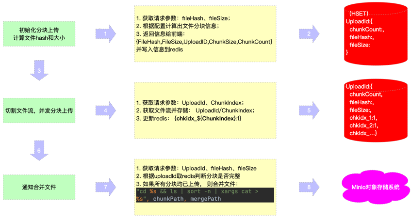

# fs-sys

go-zero+minio 文件分布式文件储存系统

## 系统架构

...

## 组件

1. go-zero
2. docker
3. etcd (负载均衡)
4. mysql (元数据存储)
5. redis (缓存)
6. minio (OSS)

## 功能

1. 用户
    1. 登录注册 ✅
    2. jwt身份校验 ✅
2. 上传文件
    1. 文件直传 ✅
    2. 分块上传 
    
   
    3. 秒传 ✅

## todo

1. oss 存储文件名使用文件sha1值 ✅
2. 使用oss自带的分片上传能力 
3. 更新文件表和用户文件表事务问题 
4. 接口文档 
5. 日志配置 
6. 大文件上传,api处理 ✅